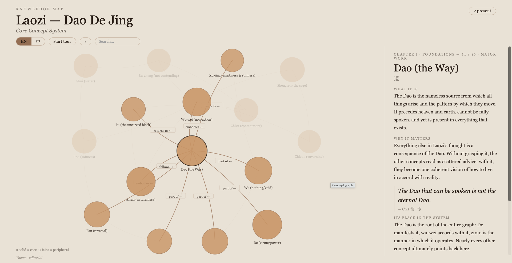
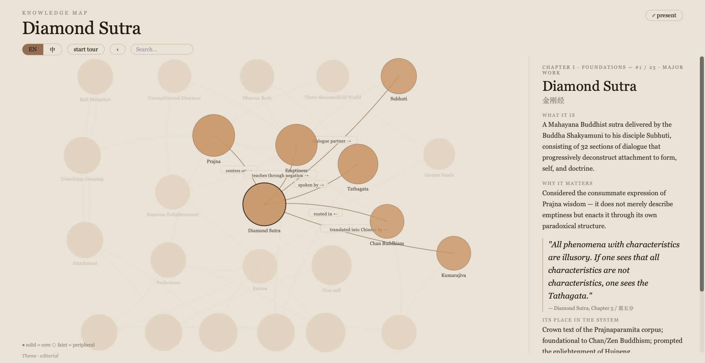
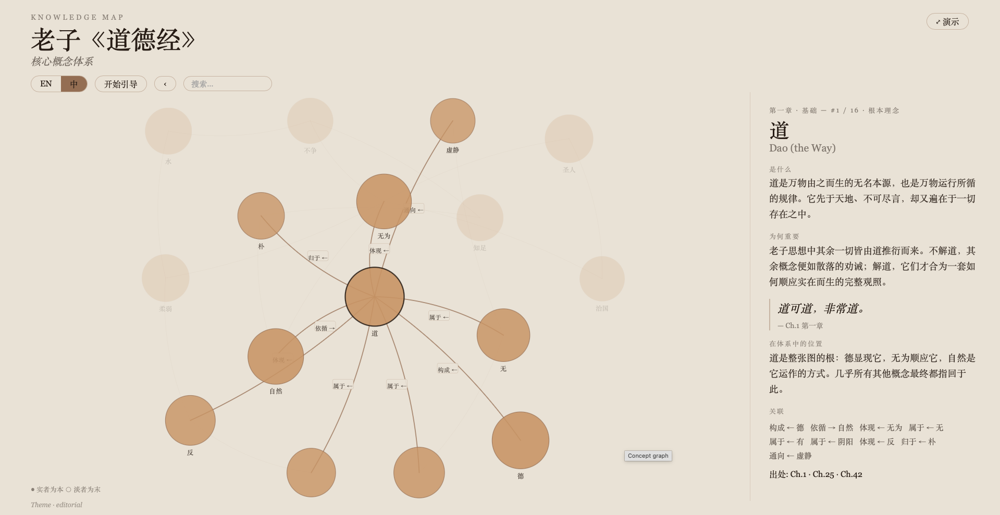
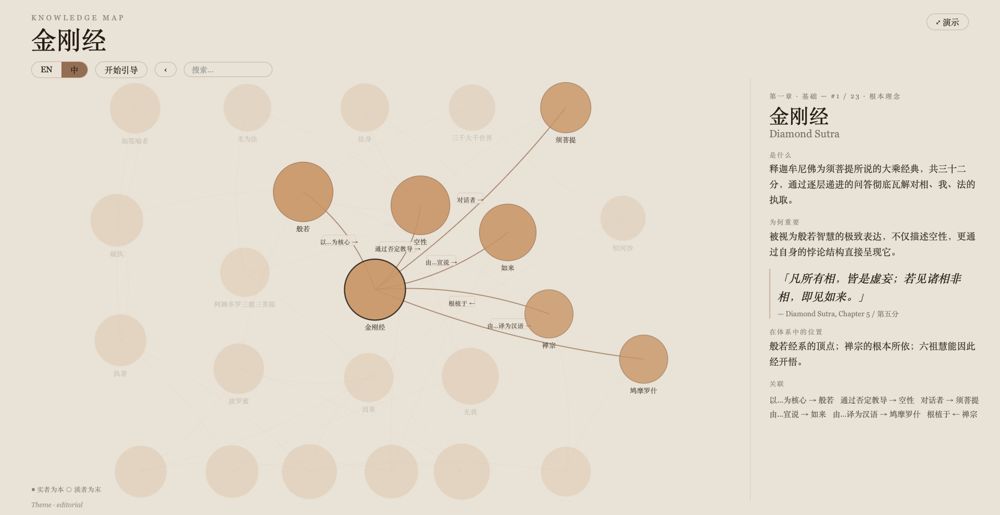

<div align="center">

# Maia

**[English](#english) · [中文](#中文)**

</div>

---

<a name="english"></a>

<div align="center">

### *graphs that teach.*

**Turn any body of knowledge into a living map that explains itself.**

[Why](#why) · [What makes it different](#what-makes-it-different) · [Gallery](#gallery) · [Quickstart](#quickstart) · [How it works](#how-it-works)

</div>

> Maia is named for the midwife-goddess behind Socrates' *maieutics* — the art of drawing understanding out of someone rather than pouring it in. Maia doesn't hand you a pile of nodes; it builds a map and leads you through until the understanding is *yours*.

## Why

You want to understand something — Stoicism, causal inference, the Daodejing, a stack of papers you've been meaning to read. The usual options fall short:

- **Search** gives you ten tabs and no shape.
- **A summary** flattens a system into a paragraph and loses every connection.
- **A raw knowledge graph** gives you a pretty hairball you can't actually learn from.

Maia gives you the thing in between: a **map that teaches**. Concepts arranged by importance, readable in depth, walkable in the right order — from bedrock ideas up to the ones that depend on them.

## What makes it different

Most "knowledge graph" tools stop at *impressive*. Maia is built to *teach*:

| | |
|---|---|
| 🧭 **Graphs that teach, not impress** | Every node carries a four-part **archive** — what it is, why it matters, its place in the system, a key quotation. A built-in **guided tour** walks concepts from foundations upward, like a patient teacher. |
| 🌏 **Two languages, two worlds** | Following Wittgenstein — *"the limits of my language are the limits of my world"* — English and Chinese graphs are extracted **independently**, then aligned. Switching language switches *worldview*, not just labels. |
| 🎨 **Taste, applied per subject** | A Daodejing map and a quantum-mechanics map should not look the same. Maia reads the subject's character and **designs a visual identity to fit** it. |
| 📄 **Feeds on your own documents** | Point Maia at your own `.md .txt .pdf .docx` files. Every concept traces back to the exact passage it came from; ideas that never share a page get connected across your library. |
| 🪶 **One file, double-click to open** | Export as a **single self-contained `.html`** — no server, no build, no network. Fullscreen-adaptive for presentation. Share like a PDF. |

## Gallery

Each graph is fully bilingual — the **EN / 中** toggle switches labels, inspector text, tour narration, and captions. Two languages, two world-views, one graph.

<details open>
<summary><strong>English</strong></summary>

<table>
<tr>
<td align="center" width="50%">

**Laozi — Dao De Jing**



</td>
<td align="center" width="50%">

**Diamond Sutra**



</td>
</tr>
</table>

</details>

<details>
<summary><strong>中文</strong></summary>

<table>
<tr>
<td align="center" width="50%">

**老子《道德经》**



</td>
<td align="center" width="50%">

**金刚经**



</td>
</tr>
</table>

</details>

> Open any `.html` · **F** to present · **← →** to walk the tour · **EN / 中** to switch worlds

## Quickstart

**As a Claude Code plugin** (recommended — uses your Claude session, no extra API key):

```bash
/plugins install github:bitqs/maia
```

Then in any Claude Code session:

```
/maia:build 道德经
/maia:build Stoicism
/maia:build --corpus ./my-notes/ --title "My Reading"
```

**Standalone** (Python, bring your own graph JSON):

```bash
git clone https://github.com/bitqs/maia && cd maia/maia-plugin/backend
python3 -m venv .venv && source .venv/bin/activate
pip install -r requirements.txt
python export_html.py ../output/graph.json out.html && open out.html
```

## How it works

```
  subject  ·  or  ·  your documents
              │
              ▼
  ┌────────────────────────────────────┐
  │  1  seed      find pillar concepts  │
  │  2  expand    per-language worlds;  │
  │               peripheral ideas in  │
  │               isolated sub-agents  │
  │  3  resolve   merge synonyms EN↔ZH │
  │  4  enrich    difficulty · tour    │
  │  5  profile   four-part archive    │
  │  6  theme     visual identity      │
  └────────────────────────────────────┘
              │
              ▼
       graph.json ──► self-contained .html
```

- **Relevance-routed sub-agents.** Peripheral concepts are explored in isolated contexts so they can't pollute the main graph — probabilistic routing, not a hard cutoff.
- **Structured outputs.** Pydantic schemas throughout — no hand-parsed JSON, no regex.
- **Two models, by job.** Fast model for extraction; stronger model for resolution and synthesis.

## Project layout

```
maia-plugin/
  backend/
    build.py          web mode — research a subject
    build_corpus.py   corpus mode — read your documents
    pipeline.py       six-stage pipeline
    export_html.py    single-file HTML export
    schemas.py        Pydantic structured-output models
    graph.py          bilingual graph contract
    evaluation/       precision/recall harness + gold set
  skills/
    build/            /maia:build Claude Code skill
examples_*.json       worked graphs (Daodejing, Stoicism)
```

## Acknowledgements

- Anthropic's [knowledge-graph cookbook](https://github.com/anthropics/claude-cookbooks) — structured extraction, description-based resolution, evaluation loop.
- **Wittgenstein** — *the limits of language are the limits of the world* — why two graphs are built apart.
- **Steve Jobs** — *ultimately it comes down to taste* — why the design adapts instead of defaulting.
- [Understand-Anything](https://github.com/Lum1104/Understand-Anything) — **graphs that teach > graphs that impress.**

## License

MIT — do anything, keep the notice.

---

<a name="中文"></a>

<div align="center">

### *能教会你的图谱。*

**把任何知识体系变成一张会自我讲解的活地图。**

[为什么](#为什么) · [有何不同](#有何不同) · [成品展示](#成品展示) · [快速开始](#快速开始) · [原理](#原理)

</div>

> Maia 得名于苏格拉底"助产术"（maieutics）背后的助产女神——把理解从人内部引出，而不是灌进去。Maia 不是把一堆节点扔给你，而是建一张地图，带你走完，直到理解变成*你自己的*。

## 为什么

你想弄懂某件事——斯多葛主义、因果推断、道德经、一叠一直没时间读的论文。常见选择都有缺陷：

- **搜索** 给你十个标签页，没有结构。
- **摘要** 把一个体系压成一段话，所有连接都消失了。
- **原始知识图谱** 看起来很酷，但根本学不进去。

Maia 给你中间那个东西：**一张能教会你的地图**。概念按重要度排列，可以深读，可以按正确顺序走——从基础往上，一直到依赖它们的那些。

## 有何不同

大多数"知识图谱"工具止步于*好看*。Maia 的目标是*教会*：

| | |
|---|---|
| 🧭 **教会，不只是展示** | 每个节点有四部分**档案**：是什么、为何重要、在体系中的位置、一句关键引言。内置**引导游览**，从基础概念向上展开，像一位有耐心的老师。 |
| 🌏 **两种语言，两个世界** | 沿维特根斯坦——"语言的界限就是世界的界限"——中英两张图**独立提取**再对齐。切换语言切换的是*世界观*，不只是标签。 |
| 🎨 **因材施形** | 道德经的图和量子力学的图不该长一个样。Maia 读取主题的气质，**设计匹配的视觉风格**。 |
| 📄 **读你自己的文档** | 把自己的 `.md .txt .pdf .docx` 喂给 Maia。每个概念溯源到原文段落；从不同文档里提取的想法跨文件连接。 |
| 🪶 **一个文件，双击打开** | 导出为**单一自包含 `.html`**——无需服务器、无需构建、不需网络。全屏自适应，能演示。像 PDF 一样分享。 |

## 成品展示

每张图完全双语——顶部 **EN / 中** 切换标签、详情面板文字、引导词、图注全部切换。两种语言，两种世界观，同一张图。

<details open>
<summary><strong>English</strong></summary>

<table>
<tr>
<td align="center" width="50%">

**Laozi — Dao De Jing**


</td>
<td align="center" width="50%">

**Diamond Sutra**


</td>
</tr>
</table>

</details>

<details>
<summary><strong>中文</strong></summary>

<table>
<tr>
<td align="center" width="50%">

**老子《道德经》**


</td>
<td align="center" width="50%">

**金刚经**


</td>
</tr>
</table>

</details>

> 打开任意 `.html` · **F** 演示 · **← →** 步进引导 · **EN / 中** 切换世界

## 快速开始

**作为 Claude Code 插件**（推荐——使用你的 Claude 对话，无需额外 API Key）：

```bash
/plugins install github:bitqs/maia
```

在任意 Claude Code 会话中：

```
/maia:build 道德经
/maia:build Stoicism
/maia:build --corpus ./my-notes/ --title "我的笔记"
```

**独立使用**（Python，自带 graph JSON）：

```bash
git clone https://github.com/bitqs/maia && cd maia/maia-plugin/backend
python3 -m venv .venv && source .venv/bin/activate
pip install -r requirements.txt
python export_html.py ../output/graph.json out.html && open out.html
```

## 原理

```
  主题  ·  或  ·  你的文档
              │
              ▼
  ┌────────────────────────────────────┐
  │  1  播种      找核心概念              │
  │  2  展开      中英独立扩展；           │
  │               低相关概念隔离子智能体  │
  │  3  对齐      合并中英同义概念        │
  │  4  丰富      难度·引导顺序          │
  │  5  建档      四部分档案             │
  │  6  定形      匹配主题的视觉风格      │
  └────────────────────────────────────┘
              │
              ▼
       graph.json ──► 单文件 .html
```

- **相关度路由子智能体。** 边缘概念在隔离上下文中探索，不污染主图——概率路由，非硬截断。
- **结构化输出。** 全程 Pydantic schema，无手工解析 JSON，无正则。
- **两种模型，各司其职。** 快速模型做高并发提取；强模型做对齐与综合。

## 项目结构

```
maia-plugin/
  backend/
    build.py          网络模式——研究一个主题
    build_corpus.py   语料模式——读你的文档
    pipeline.py       六阶段流水线
    export_html.py    单文件 HTML 导出
    schemas.py        Pydantic 结构化输出模型
    graph.py          双语图谱契约
    evaluation/       精确率/召回率评测框架
  skills/
    build/            /maia:build Claude Code 技能
examples_*.json       示例图谱（道德经、斯多葛主义）
```

## 致谢

- Anthropic [知识图谱实践](https://github.com/anthropics/claude-cookbooks)——结构化提取、描述对齐、评测循环。
- **维特根斯坦**——"语言的界限就是世界的界限"——为什么两张图要独立建构。
- **乔布斯**——"归根结底在于品味"——为什么视觉风格要因材施形。
- [Understand-Anything](https://github.com/Lum1104/Understand-Anything)——**能教会你的图谱 > 只是好看的图谱。**

## 许可证

MIT — 随意使用，保留声明即可。

<div align="center">
<sub>Built to be read, walked, and understood — not just looked at.</sub>
</div>
